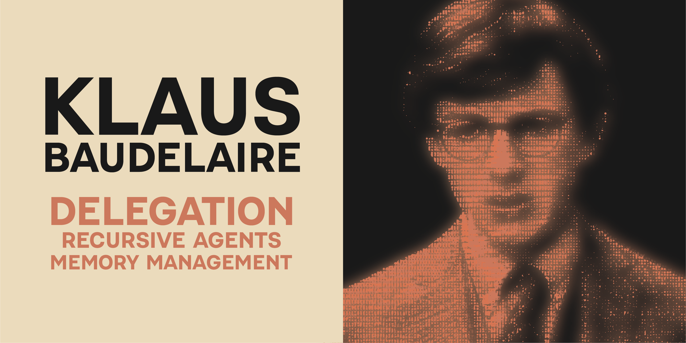

<p align="center">
  
</p>

> [!NOTE]
> Not available publicly yet. Doing comprehensive sweeps of documentation and delegation architecture.

<p align="center">
  
  
  
  <a href="https://x.com/nrx_co"></a>
</p>

# Klaus Baudelaire

**The Polymathic Delegation System for Claude Code**

> Klaus was designed from the architectural design of the Claude Code harness. Instead of protecting his sisters from villains, he serves you -- delegating agents to ship your code with intelligence and precision.

---

## What Is Klaus?

Klaus is an **intelligent task routing infrastructure** that automatically analyzes your prompts and routes them to appropriate execution tiers based on complexity.

**Before Klaus**: Manual judgment calls -- "Should I use an agent? Which one? Do I need research?"

**After Klaus**: Automatic analysis routes tasks to the optimal tier (DIRECT, LIGHT, MEDIUM, FULL).

---

## Quick Install

```bash
# Plugin Installation (Recommended)
/plugin marketplace add https://github.com/blas0/klaus-baudelaire
/plugin install klaus-baudelaire@klaus-marketplace
~/.local/share/claude/plugins/klaus-baudelaire/install.sh

# Standalone Installation
git clone https://github.com/blas0/klaus-baudelaire ~/.claude
~/.claude/.system/install.sh

# Verify
bash ~/.claude/tests/unit-tests.sh
bun ~/.claude/tests/integration-tests.ts
```

[Full Installation Guide -->](docs/01-installation.md)

---

## Architecture

```
                          +-------------------+
                          |   Your Prompt     |
                          +--------+----------+
                                   |
                          +--------v----------+
                          |  klaus-delegation  |
                          |  .sh (Hook)        |
                          |                    |
                          |  Score = keywords  |
                          |  + length bonus    |
                          |  - simple penalty  |
                          +--------+----------+
                                   |
              +----------+---------+---------+----------+
              |          |                   |          |
        +-----v--+ +----v---+        +------v---+ +---v----+
        | DIRECT | | LIGHT  |        | MEDIUM   | | FULL   |
        | 0-2    | | 3-4    |        | 5-6      | | 7+     |
        +--------+ +----+---+        +-----+----+ +---+----+
        Execute     explore-         explore-       explore-
        immediately light            light +        lead +
                                     research-      research-
                                     light +        lead +
                                     plan-          web-research-
                                     orchestrator   specialist +
                                                    plan-
                                                    orchestrator
```

---

## The 4 Tiers

| Tier | Score | Agents | Use Case |
|------|-------|--------|----------|
| **DIRECT** | 0-2 | None | Simple edits, typos |
| **LIGHT** | 3-4 | explore-light | Basic features, quick research |
| **MEDIUM** | 5-6 | explore-light + research-light + plan-orchestrator | Multi-file changes |
| **FULL** | 7+ | explore-lead + docs-specialist + research-lead + file-path-extractor + plan-orchestrator | Architecture, complex features |

[Delegation Architecture -->](docs/02-delegation-architecture.md) | [Scoring Algorithm -->](docs/03-scoring-algorithm.md)

---

## Scoring (Simplified)

```
Score = 0
  + length bonus (>100: +1, >200: +1, >400: +2)
  + COMPLEX_KEYWORDS (e.g., "system architecture": +3, "oauth": +2)
  - SIMPLE_KEYWORDS (e.g., "fix typo": -4, "just": -2)
  = Final (bounded 0-50)
```

**Example**: "Set up OAuth with tests" = "set up tests" (+3) + "oauth" (+2) = **5 = MEDIUM**

[Configuration & Keywords -->](docs/04-configuration-keywords.md)

---

## Commands

| Command | Purpose |
|---------|---------|
| `/klaus <prompt>` | Force FULL tier execution |
| `/klaus feature <action>` | Manage feature flags (list, toggle, enable, disable) |
| `/fillmemory` | Initialize project documentation structure |
| `/compost` | Extract codebase patterns into standards |
| `/updatememory` | Sync documentation with codebase |
| `/suggestkeywords` | Analyze routing telemetry for optimization |
| `/klaus-test` | Run system diagnostics |

[Memory Management -->](docs/10-memory-management.md)

---

## Agents (17)

**Delegation Specialists**:
- **plan-orchestrator** (Sonnet) -- Primary delegator for MEDIUM/FULL tasks
- **docs-specialist** (Haiku) -- Official documentation lookup
- **web-research-specialist** (Sonnet) -- Deep web research
- **file-path-extractor** (Haiku) -- File path tracking
- **test-infrastructure-agent** (Sonnet) -- Test setup
- **reminder-nudger-agent** (Haiku) -- Stagnation detection

**Research Agents**:
- **explore-lead** (Sonnet) -- Comprehensive codebase exploration for FULL tier
- **explore-light** (Haiku) -- Quick codebase recon
- **research-lead** (Opus) -- Research coordination
- **research-light** (Haiku) -- Quick web research

**Utility**: code-simplifier, composter, git-orchestrator

**RLM Agents** (Recursive Language Model - for 50K+ token documents):
- **recursive-agent** (Opus) -- RLM orchestrator
- **chunk-analyzer** (Haiku) -- Document chunk processing
- **conflict-resolver** (Sonnet) -- Deduplication and conflict resolution
- **synthesis-agent** (Sonnet) -- Final report generation

[Agent Team Reference -->](docs/11-agent-team.md)

---

## TaskList Coordination

Klaus implements heavy TaskList coordination across 11 agents:

| Role | Agents | Tools |
|------|--------|-------|
| **Creators** | research-lead, plan-orchestrator | TaskCreate, TaskUpdate, TaskList |
| **Executors** | 9 specialist agents | TaskUpdate, TaskList |
| **Monitor** | reminder-nudger-agent | TaskGet, TaskList (READ-ONLY) |

**Lifecycle**: `pending --> in_progress --> completed`

Press `Ctrl+T` in Claude Code to see task progress.

[Task Management -->](docs/12-task-management.md)

---

## 5 Core Systems

| # | System | Purpose |
|---|--------|---------|
| 1 | [Profile System](docs/05-profile-system.md) | Conservative/balanced/aggressive routing |
| 2 | [Feature Flags](docs/06-feature-flags.md) | Runtime agent/capability toggles |
| 3 | [Coverage Tracking](docs/07-coverage-tracking.md) | PS4-based Bash code coverage |
| 4 | [Production Testing](docs/08-production-testing.md) | Sandbox deployment pipeline |
| 5 | [Plan Orchestration](docs/09-plan-orchestration.md) | 7-phase agent delegation |

---

## Configuration

**File**: `~/.claude/config/klaus-delegation.conf`

```bash
SMART_DELEGATE_MODE="ON"          # Enable/disable Klaus
TIER_LIGHT_MIN=3                  # Score thresholds
TIER_MEDIUM_MIN=5
TIER_FULL_MIN=7
ENABLE_WEB_RESEARCHER="OFF"       # Agent feature flags
ENABLE_FILE_PATH_EXTRACTOR="ON"
ENABLE_TEST_INFRASTRUCTURE="OFF"
ENABLE_REMINDER_SYSTEM="OFF"
ROUTING_EXPLANATION="ON"          # Show routing rationale
DEBUG_MODE="OFF"                  # Debug logging
```

[Configuration Reference -->](docs/04-configuration-keywords.md) | [Profiles -->](docs/05-profile-system.md)

---

## Testing

### From Development Repository
```bash
# Navigate to repository root first
bash tests/unit-tests.sh              # 79 unit tests
bash tests/hooks-suite.sh             # 88 hook tests
bash tests/e2e-suite.sh               # 26 E2E tests
bun tests/integration-tests.ts        # 12 routing tests
```

### After Plugin Installation
```bash
KLAUS_ROOT=~/.local/share/claude/plugins/klaus-baudelaire
bash $KLAUS_ROOT/tests/unit-tests.sh
bash $KLAUS_ROOT/tests/hooks-suite.sh
```

### After Standalone Installation
```bash
bash ~/.claude/tests/unit-tests.sh
bash ~/.claude/tests/hooks-suite.sh
bun ~/.claude/tests/integration-tests.ts
```

**Total**: 205 tests, ~28-40s execution time

[Testing Guide -->](docs/14-testing-verification.md)

---

## Hooks

Klaus registers 1 hook (`UserPromptSubmit`) which invokes `klaus-delegation.sh`. This script sources additional modules as needed:

- **klaus-delegation.sh** -- Routing logic (always active, entry point)
- **klaus-session-state.sh** -- Async session management
- **routing-telemetry.sh** -- Privacy-first routing analytics
- **rlm-workflow-coordinator.sh** -- Recursive agent orchestration

[Hooks System -->](docs/13-hooks-system.md)

---

## Troubleshooting

**Klaus not routing?** Check `~/.claude/settings.json` for UserPromptSubmit hook.

**Wrong tier?** Test: `echo '{"prompt":"YOUR PROMPT"}' | bash ~/.claude/hooks/klaus-delegation.sh | jq`

**Tests failing?** Run: `bash ~/.claude/tests/unit-tests.sh 2>&1 | grep FAIL`

**Need debug?** Set `DEBUG_MODE="ON"` in `~/.claude/klaus-delegation.conf`

[Full Troubleshooting -->](docs/15-troubleshooting.md)

---

## Documentation

All detailed documentation lives in [`docs/`](docs/README.md):

01. [Installation](docs/01-installation.md) | 02. [Architecture](docs/02-delegation-architecture.md) | 03. [Scoring](docs/03-scoring-algorithm.md)
04. [Keywords](docs/04-configuration-keywords.md) | 05. [Profiles](docs/05-profile-system.md) | 06. [Feature Flags](docs/06-feature-flags.md)
07. [Coverage](docs/07-coverage-tracking.md) | 08. [Sandbox](docs/08-production-testing.md) | 09. [Plan Agent](docs/09-plan-orchestration.md)
10. [Memory](docs/10-memory-management.md) | 11. [Agents](docs/11-agent-team.md) | 12. [Tasks](docs/12-task-management.md)
13. [Hooks](docs/13-hooks-system.md) | 14. [Testing](docs/14-testing-verification.md) | 15. [Troubleshooting](docs/15-troubleshooting.md)

---

_"I don't know if you've ever noticed, but first impressions are often entirely wrong."_ -- Lemony Snicket
